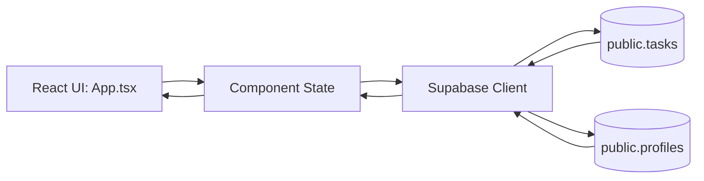

# Architecture

## High-Level Overview

The app is a single-page React client. `src/App.tsx` handles:
- Auth flow (sign in, sign up, sign out)
- Session restoration + auth state subscription
- Profile name fetch
- Task CRUD and client-side filtering
- UI rendering for auth screen + task manager screen

Supabase access is centralized through `src/lib/supabaseClient.ts`.

## Data Flow

## Module Map

- `src/main.tsx`: React entry point and app mount.
- `src/App.tsx`: Main application logic and UI composition.
- `src/lib/supabaseClient.ts`: Supabase client initialization and config error guard.
- `src/App.css`: App-level styling (layout, forms, task list, sidebar, tags).
- `src/index.css`: Global styles and theme-specific overrides.
- `vite.config.ts`: Build config and GitHub Pages base path.
- `.github/workflows/deploy.yml`: GitHub Actions Pages build/deploy.
- `.github/workflows/docs-required.yml`: Docs enforcement workflow for code changes.

## Notes

- Current architecture is intentionally simple (single top-level component).
- TODO: If code grows, consider extracting feature-level hooks/components while preserving behavior.

